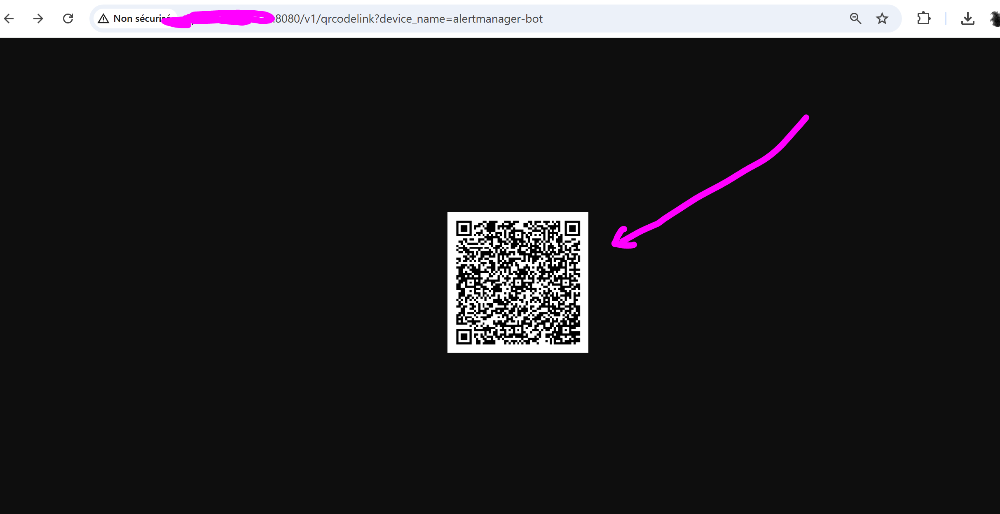
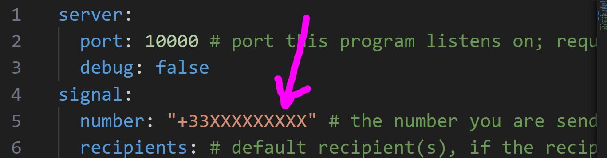

# Thanks first

* to https://github.com/ruanbekker for https://github.com/ruanbekker/docker-monitoring-stack-gpnc (we use version `6b96c143fbe2a1c06ac8fd750c15e7d7d1ef1dbb`)

* to https://github.com/schlauerlauer for https://github.com/schlauerlauer/alertmanager-webhook-signal (we use version `9730f6b6a6ab19982cf16b931927b714f2a663a2`)
* to https://github.com/bbernhard for https://github.com/bbernhard/signal-cli-rest-api (we use version `0.98`)

* to https://github.com/orgs/3forges/people/elchusco who did a big part of the work discovering the alertmanager / signal integration configuration details.

## Deploy

* git clone this repository , checkout the latest release

* Start the `signal-cli-rest-api`, to configure it:

```bash
docker-compose up -d signal-cli-rest-api
```

* When the the `signal-cli-rest-api` service has started, go in your bowser at `http://<IP address of your VM>:8080/v1/qrcodelink?device_name=alertmanager-bot`, and scan the QR code uisng that appears at that page, using the Signal App on you phone (this step realizes authentication and stores signal auth secrets inside the git-ignored `configs/signal-cli-rest-api` folder):



* Now your `signal-cli-rest-api` can talk to signal authenticated as the authenticated signal user you used to scan the QR code with (with the signal mobile phone app). Note that an identity in the signal API is called an "Account", and that every account has a phone number associated to it. So using that identity, you will find the ID of the Signal Group you want alertmanager to send notifications to, and generate the `./configs/alertmanager-webhook-signal/config.yaml` configuration file like this:

```bash
export PHONE_NUMBER_OF_THE_ACCOUNT='+33XXXXXXXXX'
export NETWORK_IP_OR_NAME_OF_VM='<ip address or netname>'

export PHONE_NUMBER_OF_THE_ACCOUNT='+33688367187'
export NETWORK_IP_OR_NAME_OF_VM='openbao.pesto.io'
export NETWORK_IP_OR_NAME_OF_VM='127.0.0.1'
# ---
# name of the 
export GRP_NAME='[PDL] hébergement'

curl -ivvv http://${NETWORK_IP_OR_NAME_OF_VM}:8080/v1/groups/${PHONE_NUMBER_OF_THE_ACCOUNT} 

curl -ivvv http://${NETWORK_IP_OR_NAME_OF_VM}:8080/v1/groups/${PHONE_NUMBER_OF_THE_ACCOUNT} | tail -n 1 | jq --arg GRP_NAME "$GRP_NAME" ' .[] | select( .name == $GRP_NAME )'

curl -ivvv http://${NETWORK_IP_OR_NAME_OF_VM}:8080/v1/groups/${PHONE_NUMBER_OF_THE_ACCOUNT} | tail -n 1 | jq --arg GRP_NAME "$GRP_NAME" ' .[] | select( .name == $GRP_NAME )' | jq .id

export UR_SIGNAL_GRP_ID=$(curl http://${NETWORK_IP_OR_NAME_OF_VM}:8080/v1/groups/${PHONE_NUMBER_OF_THE_ACCOUNT} | tail -n 1 | jq --arg GRP_NAME "$GRP_NAME" ' .[] | select( .name == $GRP_NAME )' | jq .id | awk -F '"' '{ print $2 }')

echo "UR_SIGNAL_GRP_ID = [${UR_SIGNAL_GRP_ID}]"


cat <<EOF >./configs/alertmanager-webhook-signal/config.yaml

server:
  port: 10000 # port this program listens on; required
  debug: false
signal:
  number: "${PHONE_NUMBER_OF_THE_ACCOUNT}" # the number you are sending messages from; required
  recipients: # default recipient(s), if the recipients label is not set in alert; required
    - "${UR_SIGNAL_GRP_ID}" # that's the PDL signal group ID
  send: http://signal_cli_rest_api:8080/v2/send # http endpoint of the signal-cli; required
alertmanager:
  # ignoreLabels: # filter labels in the message; optional
  #   - "whatever"
  # ignoreAnnotations: [] # filter annotations in the message; optional
  generatorURL: false # include generator URL in the message; optional (default: false)
#   matchLabel: "recipients"
# recipients: # optional list of recipient names and numbers for label matching
#   alice: "+33723123123"
#   bob: "+33734234234"

EOF

```

* For the record, the signal user identity (account) phone number should end up there in the generated configuration `./configs/alertmanager-webhook-signal/config.yaml` file:



Now start it:

```bash
OPS_USER_UID_GID="$(id -u):$(id -g)" docker-compose up -d
```

## Testing the Alertmanager / signal integration

In below examples `openbao.pesto.io` is the machine network name where everything runs.

* We create an alert in alertmanager (imulating that prometheus did so):

```bash

curl -X POST http://openbao.pesto.io:9093/api/v2/alerts \
  -H "Content-Type: application/json" \
  -d '[{
    "status": "firing",
    "labels": {
        "alertname": "NOUVEAU TEST alertePDL3Test",
        "severity": "critical",
        "jourDeLaSemaine": Dimanche"
    },
    "annotations": {
        "summary": "je veux partir en vacances",
        "description": "ou au moins un weekend à marseille"
    }
  }]'
```

* TO test network connection between the alertmanager container and the webhook server container:

```bash
docker exec -it alertmanager sh -c 'wget http://alertmanager_webhook_signal:10000/alertmanager'

# --
# If the network connection is fine you should get something like:
# Connecting to alertmanager_webhook_signal:10000 (172.26.0.2:10000)
# wget: server returned error: HTTP/1.1 405 Method Not Allowed
```

* Then check the new alert is there at http://openbao.pesto.io:9093/#/alerts

* We send a request to check that the webhook server can receive requests (at least we check that if the webhook server receives a request, we will see it in the logs):

```bash

curl -X INFO http://openbao.pesto.io:10000/alertmanager


curl -X POST http://openbao.pesto.io:10000/alertmanager \
  -H "Content-Type: application/json" \
  -d '{
    "alerts": [
      {
        "status": "firing",
        "labels": {
          "alertname": "alertePDL",
          "severity": "critical"
        },
        "annotations": {
          "summary": "Hello from curl",
          "description": "DAns la config du wbehook il y a le fitre sur alertname Direct webhook test"
        }
      }
    ]
  }'


```

* then we check:
  * in the rest api logs if we see that `docker-compose logs -f signal-cli-rest-api`
  * acording https://github.com/schlauerlauer/alertmanager-webhook-signal/blob/9730f6b6a6ab19982cf16b931927b714f2a663a2/internal/alerts/alert_handler.go#L54 we shuld see something int he ogs if the request to the signal api failed , but yet nothing


* we check that the signal rest api works, by sending a request to that api we send a message to signal successfully:

```bash
curl -ivvv -d '{ "number": "+336XXXXXXXX", "recipients": [ "group.ZnhyMTBVeGY0ZWlrMmRkWXlGSEFrTzgyVmVQNTJjNXJTdUVMdlpaRVM0dz0=" ], "message": "test api avec curl pour PDL" }' -X POST http://openbao.pesto.io:8080/v2/send
# and to see logs :  docker-compose logs -f signal-cli-rest-api
```


curl -X POST http://openbao.pesto.io:9093/api/v2/alerts \                                  
-H "Content-Type: application/json" \
-d '[{
    
"labels": {                
    "alertname": "TestAlert",
    "severity": "critical"
},              
"annotations": {                   
    "summary": "This is a test alert - nan la c jb"
}
}]'

## References

* Swagger of the `signal-cli-rest-api`: https://bbernhard.github.io/signal-cli-rest-api
* You should be aware of: https://github.com/LibreSignal/LibreSignal/issues/37#issuecomment-217211165